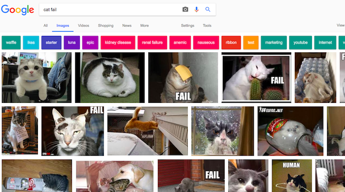
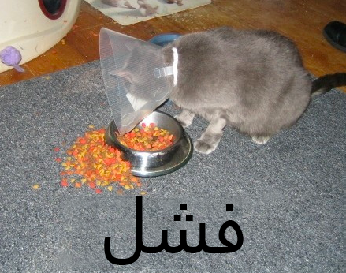

بسبب قانون حقوق النشر ، لا يمكنك استخدام كل ما تجده على الويب. ستتعلم هنا كيفية العثور على الصور التي يمكنك استخدامها في صنعك الرقمي دون خرق قوانين حقوق النشر.

### فهم قانون حقوق النشر

تم تصميم قانون حقوق الطبع والنشر لحماية المبدعين من الأعمال الفنية والأدبية والموسيقية والدرامية من استغلال أعمالهم أو إساءة استخدامها. هذا يعني أن قانون حقوق الطبع والنشر ينطبق على جميع أنواع المواد غير المتصلة بالإنترنت وعبر الإنترنت ، بما في ذلك الصور والأعمال الفنية.

أي شخص يستخدم عملاً محمياً بحقوق الطبع والنشر دون إذن المالكين هو مذنب في انتهاك حقوق النشر. هذا صحيح في بعض الأحيان حتى لو تم تغيير الكثير من الأشياء حول العمل.

العديد من الصور على الإنترنت محمية بحقوق الطبع والنشر. ليس من الضروري وجود رمز حقوق الطبع والنشر © في صورة تمتلك حقوق النشر.

إذا كنت تريد استخدام صورة تحتاج إلى إذن بشأنها ، فستحتاج إلى الحصول على إذن من جميع مالكي حقوق الطبع والنشر. وإلا ، يمكنك البحث عن الصور التي يمكنك استخدامها مجانًا من خلال ترخيص المشاع الإبداعي.

### المشاع الإبداعي

يسمح ترخيص المشاع الإبداعي لمنشئ صورة ما بتحديد الأذونات التي يريدون منحها للأشخاص لعملهم مجاناً. مع ترخيص المشاع الإبداعي ، يمكنك التخلي عن جميع حقوق عملك ، أو بعض منها فقط. يوجد نموذج عبر الإنترنت على موقع [Creative Commons على الويب](https://creativecommons.org/){:target="_blank"} يساعدك على معرفة حقوقك التي تريد منحها على وجه التحديد.

يسهل ترخيص المشاع الإبداعي للأشخاص العثور على صور لديهم إذن باستخدامها. على موقع المشاع الإبداعي، وهناك [أداة بحث](https://search.creativecommons.org/){:target="_blank"} يمكنك استخدامها للعثور على الصور التي لديها ترخيص المشاع الإبداعي. هناك مكان جيد آخر للبحث عن الصور المتاحة بموجب ترخيص المشاع الإبداعي وهو [Wikimedia Commons](https://commons.wikimedia.org/wiki/Main_Page){:target="_blank"}.

تتميز العديد من محركات البحث أيضاً بطريقة للبحث عن الصور بترخيص المشاع الإبداعي ، بحيث يمكن للأشخاص تجنب انتهاك قانون حقوق النشر.

### البحث عن الصور مع جوجل

إذا كنت تستخدم Google ، فاتبع الإرشادات أدناه للعثور على صورة يمكنك استخدامها في صنعك الرقمي:

+ انتقل إلى صور Google واكتب ما تبحث عنه. هنا ، بحثنا عن `cat fail`:

+ انقر على **Search Tools**, ثم **Usage Rights**, وحدد **Labeled for reuse**.

+ اختر صورة

+ تحقق مرة أخرى من أنه مجاني للاستخدام. يمكنك استخدام أداة البحث العكسي عن الصور مثل [TinEye](https://www.tineye.com/){:target="_blank"} أو [Image Raider](https://www.imageraider.com/){:target="_blank"} للتحقق من أي حقوق استخدام أخرى. هنا ، قمت بنسخ رابط الصورة من بحث Google ، وقم بلصقه في TinEye ، وضغطت على **Search**. كما ترون ، تم استخدام الصورة عدة مرات (781!) في جميع أنحاء الإنترنت ، لذلك فمن المحتمل أن يكون مجانيًا للاستخدام. إذا كنت في شك ، يجب عليك الكتابة إلى المالك وطلب الإذن.

### السلامة على الإنترنت

إذا قمت [باكتشاف بالصدفة صورة غير مقبولة ](https://www.thinkuknow.co.uk/11_13/Need-advice/Things-you-see-online/){:target="_blank"}، إغلق المتصفح على الفور واخبر شخصاً بالغاُ.