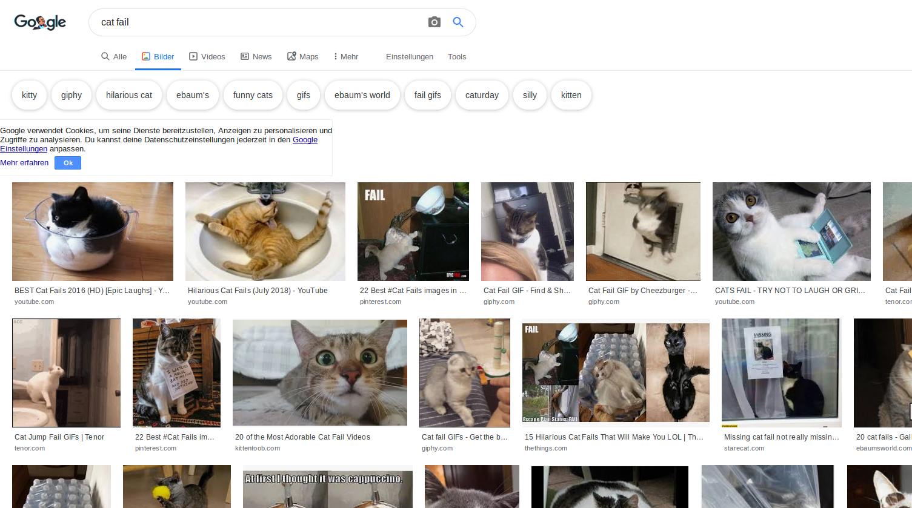
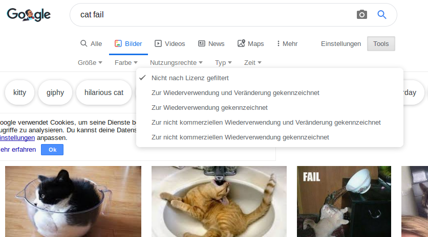
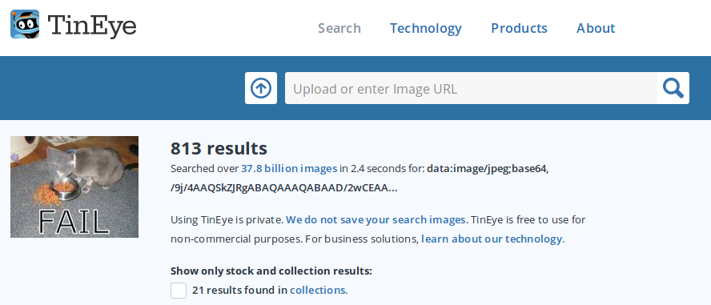

Aus urheberrechtlichen Gründen kann man nicht alles verwenden, was man im Internet findet. Hier erfährst du wie man Bilder findet, die man für digitales Making verwenden kann, ohne das Urheberrecht zu verletzen.

### Das Urheberrecht verstehen

Das Urheberrecht soll Schöpfer künstlerischer, literarischer, musikalischer und dramatischer Werke davor schützen, dass ihre Werke missbraucht oder ausgenutzt werden. Dies bedeutet, dass das Urheberrecht für alle Arten von Materialien gilt, die offline und online sind, einschließlich Bilder und Kunstwerke.

Jeder, der ein urheberrechtlich geschütztes Werk ohne die Erlaubnis des Eigentümers verwendet, macht sich einer Urheberrechtsverletzung schuldig. Dies ist manchmal auch dann der Fall, wenn an dem Werk viel geändert wurde.

Viele Bilder im Internet sind urheberrechtlich geschützt. Das Copyright-Symbol © muss nicht im Bild vorhanden sein, damit Copyright git.

Wenn du ein Bild verwenden möchtest für das eine Genehmigung erforderlich ist, musst du die Genehmigung aller Urheberrechtsinhaber einholen. Andernfalls kann man über die Creative Commons-Lizenzierung nach Bildern suchen, die kostenlos verwendet werden können.

### Creative Commons

Mit der Creative-Commons-Lizenz kann der Ersteller eines Bildes auswählen, welche Berechtigungen an seinem Werk er welchen Personen kostenlos erteilen möchte. Mit der Creative Commons-Lizenz kann man alle oder nur einige Rechte an der eigenen Arbeit vergeben. Auf der [Creative Commons-Website](https://creativecommons.org/){: target = "_ blank"} befindet sich ein Online-Formular, mit dem man genau herausfinden kann, welche Rechte man freigeben möchte.

Die Creative Commons-Lizenzierung erleichtert es Bilder zu finden zu deren Benutzung man berechtigt ist. Auf der Creative Commons-Webseite gibt es ein [Suchwerkzeug](https://search.creativecommons.org/){: target = "_ blank"}, mit dem man Bilder mit einer Creative Commons-Lizenz finden kann. Ein weiterer guter Ort, um nach Bildern zu suchen, die unter einer Creative Commons-Lizenz verfügbar sind, ist [Wikimedia Commons](https://commons.wikimedia.org/wiki/Main_Page){: target = "_ blank"}.

Viele Suchmaschinen bieten ebenfalls die Möglichkeit nach Bildern mit einer Creative Commons-Lizenz zu suchen, damit die Nutzer nicht gegen das Urheberrecht verstoßen.

### Suchen nach Bildern mit Google

Wenn du Google verwendest, befolge die nachstehenden Anweisungen, um ein Bild zu finden, das du für deine digitalen Produkte verwenden kannst:

+ Gehe zu Google Bilder und gib ein, wonach du suchst. Hier haben wir nach `cat fail`gesucht:

+ Klicke auf **Tools**, dann auf **Nutzungsrechte**und wähle **Zur Wiederverwendung gekennzeichnet**.

+ Wähle ein Bild.

+ Überprüfe noch einmal, ob die Nutzung kostenlos ist. Du kannst ein Reverse-Image-Suchwerkzeug wie [TinEye](https://www.tineye.com/){: target = "_ blank"} oder [Image Raider](https://www.imageraider.com/){: target = "_ blank"} verwenden, um nach weiteren Nutzungsrechten zu suchen. Hier habe ich den Bildlink aus der Google-Suche kopiert, in TinEye eingefügt und **Search**gedrückt. Wie du siehst, wurde das Bild viele Male (813!) im Internet verwendet, sodass es wahrscheinlich kostenlos verwendet werden kann. Im Zweifelsfall solltest du dem Eigentümer schreiben und um Erlaubnis bitten.

### Online Sicherheit

Wenn du [versehentlich ein Bild entdeckst, das du als störend empfindest](https://www.thinkuknow.co.uk/11_13/Need-advice/Things-you-see-online/){: target = "_ blank"}, schließe sofort deinen Browser und teile es einem Erwachsenen mit.