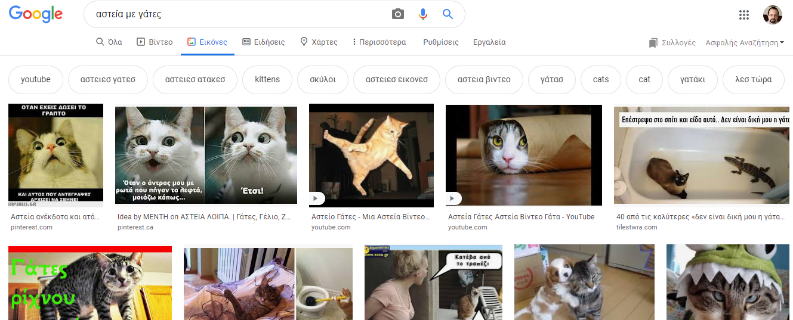
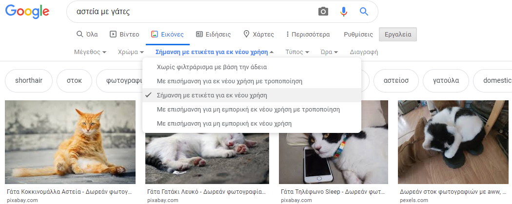
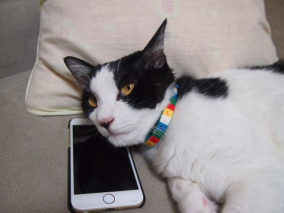
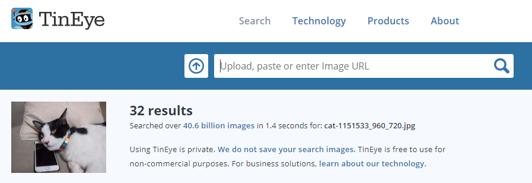

Εξαιτίας του νόμου περί πνευματικών δικαιωμάτων, δεν μπορείς να χρησιμοποιείς ό, τι βρίσκεται στον ιστό. Εδώ θα μάθεις πώς μπορείς να βρεις εικόνες που μπορείς να χρησιμοποιήσεις για την ψηφιακή σου δημιουργία χωρίς να παραβιάσεις τους νόμους περί πνευματικών δικαιωμάτων.

### Κατανόηση του νόμου περί πνευματικών δικαιωμάτων

Ο νόμος περί πνευματικών δικαιωμάτων έχει σχεδιαστεί για να προστατεύει τους δημιουργούς καλλιτεχνικών, λογοτεχνικών, μουσικών και δραματικών έργων από την εκμετάλλευση ή κατάχρηση του έργου τους. Αυτό σημαίνει ότι ο νόμος περί πνευματικών δικαιωμάτων έχει εφαρμογή σε όλους τους τύπους υλικών εκτός σύνδεσης και σε σύνδεση, συμπεριλαμβανομένων των εικόνων και των έργων τέχνης.

Οποιοσδήποτε χρησιμοποιεί έργο που προστατεύεται από πνευματικά δικαιώματα χωρίς την άδεια των ιδιοκτητών είναι ένοχος παραβίασης πνευματικών δικαιωμάτων. Αυτό είναι μερικές φορές αληθές ακόμη και αν πολλά πράγματα έχουν τροποποιηθεί σχετικά με το έργο.

Πολλές εικόνες στο διαδίκτυο προστατεύονται από πνευματικά δικαιώματα. Το σύμβολο πνευματικών δικαιωμάτων © δεν είναι απαραίτητο να υπάρχει στην εικόνα για να υπάρχουν δικαιώματα πνευματικής ιδιοκτησίας.

Αν θέλεις να χρησιμοποιήσεις μια εικόνα για την οποία χρειάζεσαι άδεια, θα πρέπει να λάβεις άδεια από όλους τους κατόχους των πνευματικών δικαιωμάτων. Διαφορετικά, μπορείς να αναζητήσεις εικόνες που είναι δωρεάν για να τις χρησιμοποιήσεις μέσω της άδειας χρήσης του Creative Commons (Δημιουργικά Κοινά).

### Creative Commons (Δημιουργικά Κοινά)

Η άδεια Creative Commons (Δημιουργικά Κοινά) επιτρέπει στον δημιουργό μιας εικόνας να επιλέξει ποια δικαιώματα θέλει να δώσει στους ανθρώπους ώστε να την κάνουν χρήση στη δουλειά τους δωρεάν. Με την άδεια Creative Commons (Δημιουργικά Κοινά) μπορείς να χαρίσεις όλα τα δικαιώματα στη δουλειά σου, ή μόνο μερικά από αυτά. Υπάρχει μια ηλεκτρονική φόρμα στην [Creative Commons ιστοσελίδα](https://creativecommons.org/){:target="_blank"} που σε βοηθάει να καταλάβεις ακριβώς ποια από τα δικαιώματά σου θέλεις να χαρίσεις.

Η αδειοδότηση του Creative Commons (Δημιουργικά Κοινά) διευκολύνει τους χρήστες να βρουν εικόνες για τις οποίες έχουν άδεια χρήσης. Στην ιστοσελίδα Creative Commons, υπάρχει ένα [εργαλείο αναζήτησης](https://search.creativecommons.org/){:target="_blank"} το οποίο μπορείς να χρησιμοποιήσεις για να βρεις εικόνες με άδεια Creative Commons (Δημιουργικά Κοινά). Ένα άλλο καλό μέρος για να αναζητήσεις εικόνες που διατίθενται με άδεια Creative Commons (Δημιουργικά Κοινά) είναι τα [Wikimedia Commons](https://commons.wikimedia.org/wiki/Main_Page){:target="_blanc"}.

Πολλές μηχανές αναζήτησης διαθέτουν επίσης έναν τρόπο αναζήτησης εικόνων με άδεια Creative Commons (Δημιουργικά Κοινά), έτσι ώστε οι άνθρωποι να αποφεύγουν να παραβιάζουν το νόμο περί πνευματικών δικαιωμάτων.

### Αναζήτηση εικόνων με το Google

Εάν χρησιμοποιείς το Google, ακολούθησε τις παρακάτω οδηγίες για να βρεις μια εικόνα που μπορείς να χρησιμοποιήσεις για την ψηφιακή παραγωγή σου:

+ Πηγαίνετε στο Google Εικόνες και πληκτρολογήστε αυτό που ψάχνετε. Εδώ, αναζητήσαμε `αστεία με γάτες`:

+ Κάνε κλικ στο **Εργαλεία**, μετά στο **Δικαιώματα χρήσης**, και επέλεξε **Σήμανση με ετικέτα για εκ νέου χρήση**.

+ Επέλεξε μια εικόνα.

+ 'Ελεγξε ξανά ,αν είναι δωρεάν για χρήση. Μπορείς να χρησιμοποιήσεις ένα εργαλείο αντίστροφης αναζήτησης εικόνας όπως το [TinEye](https://www.tineye.com/){:target="_blank"} ή το [Image Raider](https://www.imageraider.com/){:target="_blank"} για να ελέγξεις για τυχόν περαιτέρω δικαιώματα χρήσης. Εδώ, αντέγραψα το link της εικόνας από την αναζήτηση στο Google, το επικόλλησα στο TinEye και πάτησα **Αναζήτηση**. Όπως μπορείς να δεις, η εικόνα έχει χρησιμοποιηθεί 32 φορές σε όλο το διαδίκτυο, οπότε είναι πιθανό ότι είναι ελεύθερη για χρήση. Σε περίπτωση αμφιβολίας, θα πρέπει να επικοινωνήσεις με τον ιδιοκτήτη και να ζητήσεις άδεια.

### Ασφάλεια στο διαδίκτυο

Εάν [τυχαία εντοπίσεις μια εικόνα που σου προκαλεί αναστάτωση](https://www.thinkuknow.co.uk/11_13/Need-advice/Things-you-see-online/){:target="_blank"}, κλείσε αμέσως το πρόγραμμα περιήγησης και ενημέρωσε έναν ενήλικα.