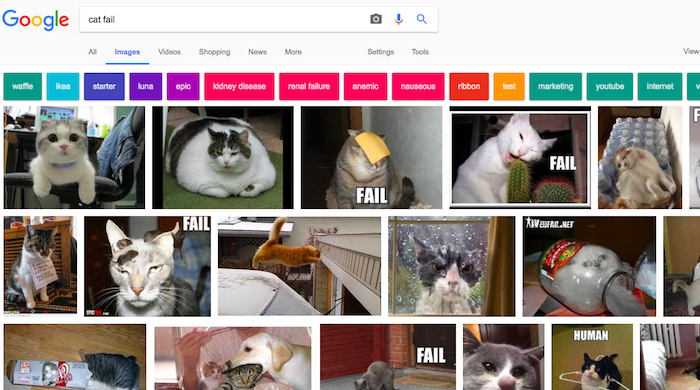

Because of Copyright Law, you cannot use everything you find on the web. Here, you will learn how to find images with the right permissions to use so that you're not breaking copyright laws with your digital making.

### Understanding Copyright Law

Copyright law is designed to protect creators of artistic, literary, musical and dramatic works from having their work exploited or misused. Copyright law applies to all manner of materials and applies to digital publishing, including images and digital graphic art work.

Anyone who republishes, reproduces or redistributes a copyrighted work without the owners' permission is guilty of copyright infringement, sometimes even if the work has been changed significantly.

The majority of images on the internet are likely to be protected by copyright. The copyright symbol does not have to be present for copyright to exist.

If permission is required to use an image, permission will need to be obtained from all the copyright owners. Otherwise, you can search for images that are free for you to use through Creative Commons licensing.

### Creative Commons

If you want to give rights to others to use your image, Creative Commons gives you an easy way to do that. Creative Commons licensing allows the creator of the image to select which permissions they want to give to people, for free.

With Creative Commons licensing you can give away all rights to your work, or just some of them. The site has an online form that helps you to configure exactly which of your rights you want to give away.

Having Creative Commons licensing makes it easier for people to find images that they have permission to use and many search engines now feature a way to search for these images so that people can avoid breaking copyright law.

### Searching for Images with Google

If you are using Google, follow the instructions below to find an image you can use in your digital making:

1) Go to Google Images, and type in what you are searching for. Here, I searched for cat fails:

2) Click on Search Tools, then Usage Rights and select Labeled for Reuse.

3) Choose an image.

4) Double check whether it is free to use. You can use a reverse image search like TinEye or ImageRaider to check any further usage rights. Here, we have copied the image link from the Google search, pasted it into TinEye, and pressed search. As I can see, it has been used many times by people all over the internet, so it is likely that it is free to use. If in doubt, write to the owner and ask for permission.

