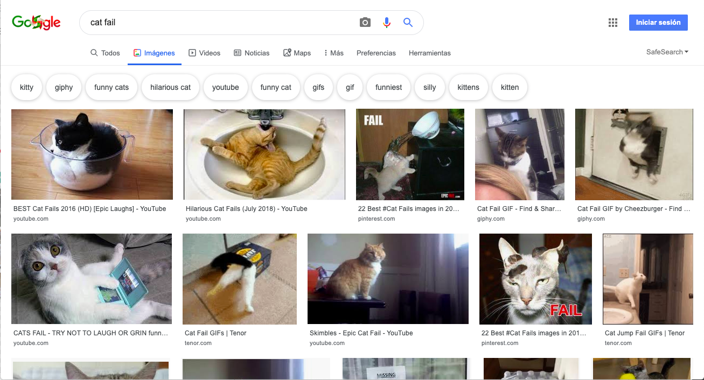
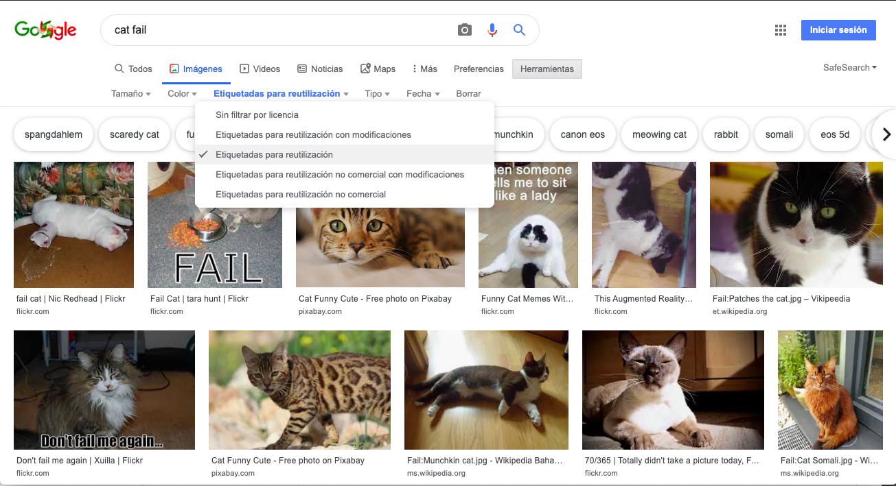
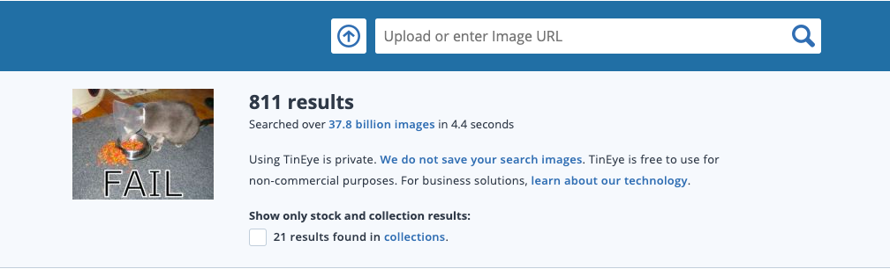

Debido a la ley de derechos de autor, no puedes usar todo lo que encuentres en la web. Aquí aprenderás cómo encontrar imágenes que pueden ser usadas en tu creación digital sin violar las leyes de derechos de autor.

### Qué dice la ley de derechos de autor

La ley de derechos de autor está diseñada para proteger a los creadores de obras artísticas, literarias, musicales y dramáticas para evitar que su trabajo sea explotado o mal utilizado. Esto significa que la ley de derechos de autor se aplica a todo tipo de materiales fuera de línea y en línea, incluidas imágenes e ilustraciones.

Cualquier persona que use un trabajo protegido por derechos de autor sin el permiso del propietario es culpable de una infracción de los derechos de autor. Esto a veces es cierto incluso aunque se hayan cambiado muchas cosas en el trabajo.

Muchas imágenes en Internet están protegidas por derechos de autor. El símbolo de derechos de autor © no tiene que estar presente de forma obligatoria en la imagen para que existan los derechos de autor.

Si deseas utilizar una imagen para la que necesitas permiso, deberás obtener el permiso de todos los propietarios de los derechos de autor. Pero también puedes buscar imágenes que pueden ser usadas de forma gratuita a través de la licencia Creative Commons.

### Creative Commons

La licencia Creative Commons permite al creador de una imagen seleccionar qué permisos de su trabajo desea otorgar de forma gratuita a otras personas. Con la licencia Creative Commons puedes ceder todos los derechos de tu trabajo, o solo algunos de ellos. En el sitio web [Creative Commons](https://creativecommons.org/){: target = "_ blank"} hay un formulario en línea que te ayuda a determinar exactamente cuáles de tus derechos deseas ceder.

La licencia Creative Commons hace que sea más fácil para las personas encontrar imágenes que tienen permiso para ser usadas. En el sitio de Creative Commons hay una [herramienta de búsqueda](https://search.creativecommons.org/){: target = "_ blank"} que puedes usar para buscar imágenes que tengan una licencia Creative Commons. Otro buen lugar para buscar imágenes disponibles bajo una licencia Creative Commons es [Wikimedia Commons](https://commons.wikimedia.org/wiki/Main_Page) {: target = "_ blank"}.

Muchos motores de búsqueda también ofrecen una forma de buscar imágenes con licencia Creative Commons para que las personas eviten infringir la ley de derechos de autor.

### Buscar imágenes con Google

Si estás utilizando Google, sigue las instrucciones que aparecen a continuación para encontrar una imagen que pueda ser usada en tu creación digital:

+ Vé a Google Images y escribe lo que estás buscando. Por ejemplo, buscamos `cat fail` (cosas graciosas que les pasan a los gatos):

+ Haz clic en **Herramientas**, luego **Derechos de uso**, y selecciona **Etiquetadas para reutilización**.

+ Elige una imagen.

+ Vuelve a verificar que realmente sea de uso gratuito. Puedes utilizar una herramienta de búsqueda inversa de imágenes como [TinEye](https://www.tineye.com/){: target = "_ blank"} o [Image Raider](https://www.imageraider.com/){: target = "_ blank"} para comprobar que no tenga algún otro derecho de uso. Copia el enlace de la imagen de la búsqueda de Google, pégalo en TinEye y haz clic en **el icono de la lupa** para buscar. Como puedes ver, la imagen se ha usado muchas veces (¡781!) en todo Internet, por lo que es probable que realmente sea de uso gratuito. En caso de duda, debes escribir al propietario y pedir permiso.

### Seguridad en linea

Si [descubres accidentalmente una imagen perturbadora o que te molesta](https://www.thinkuknow.co.uk/11_13/Need-advice/Things-you-see-online/){: target = "_ blank"}, cierra el navegador de inmediato y díselo a un adulto.