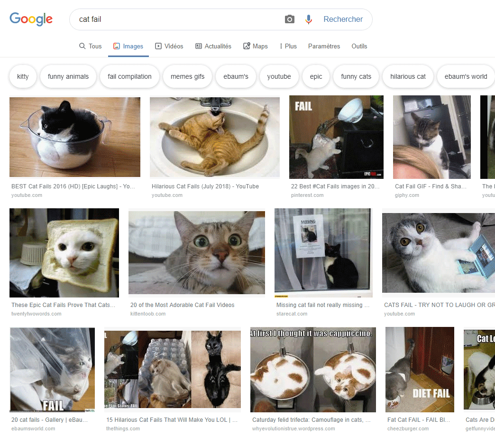
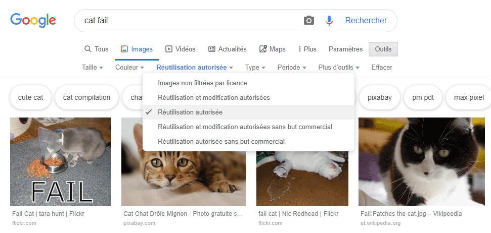

En raison du droit d'auteur, tu ne peux pas utiliser tout ce que tu trouves sur le Web. Ici, tu apprendras comment trouver des images que tu peux utiliser dans ta création numérique sans enfreindre les lois sur le droit d'auteur.

### Comprendre le droit d'auteur

La loi sur le droit d'auteur vise à protéger les créateurs d'œuvres artistiques, littéraires, musicales et dramatiques de l'exploitation ou de la mauvaise utilisation de leurs œuvres. Cela signifie que la loi sur le droit d'auteur s'applique à tous les types de contenu hors ligne et en ligne, y compris les images et les œuvres d'art.

Quiconque utilise une œuvre protégée par le droit d'auteur sans l'autorisation des propriétaires est coupable de violation du droit d'auteur. Cela est parfois vrai même si beaucoup de choses ont changé dans l'oeuvre.

De nombreuses images sur Internet sont protégées par le droit d'auteur. Le symbole de copyright © ne doit pas obligatoirement être présent dans l'image pour que le copyright existe.

Si tu souhaites utiliser une image pour laquelle tu as besoin d'une autorisation, tu devras obtenir l'autorisation de tous les détenteurs des droits d'auteur. Sinon, tu peux rechercher des images que tu peux utiliser gratuitement avec les licences Creative Commons.

### Creative Commons

Les licences Creative Commons permettent au créateur d’une image de sélectionner gratuitement les autorisations qu’ils souhaitent accorder aux utilisateurs. Avec les licences Creative Commons, tu peux céder tous les droits de ton oeuvre, ou seulement certains d'entre eux. Il existe un formulaire en ligne sur le site Web [Creative Commons](https://creativecommons.org/){: target = "_ blank"} qui t'aide à déterminer exactement quels droits tu souhaites céder.

Les licences Creative Commons facilitent la recherche des images libres de droits. Sur le site Creative Commons, il y a un [outil de recherche](https://search.creativecommons.org/){: target = "_ blank"} que tu peux utiliser pour trouver des images qui ont une licence Creative Commons. Un autre bon endroit pour chercher des images disponibles sous licence Creative Commons est [Wikimedia Commons](https://commons.wikimedia.org/wiki/Main_Page){: target = "_ blank"}.

De nombreux moteurs de recherche offrent également un moyen de rechercher des images avec une licence Creative Commons, afin que les utilisateurs ne puissent enfreindre la loi sur le droit d'auteur.

### Recherche d'images avec Google

Si tu utilises Google, suis les instructions ci-dessous pour trouver une image que tu peux utiliser dans ta création numérique:

+ Va sur Google Images et tape ce que tu recherches. Ici, nous avons recherché `cat fail`:

+ Clique sur **Outils de recherche**, ensuite **Droits d'usage** et sélectionne **Réutilisation autorisée**.

+ Choisis une image.

+ Revérifie que son utilisation est libre. Tu peux utiliser un outil de recherche d'image inversée tel que [TinEye](https://www.tineye.com/){: target = "_ blank"} ou [Image Raider](https://www.imageraider.com/){: target = "_ blank"} pour rechercher d'autres droits d'utilisation. Ici, j'ai copié le lien de l'image à partir de la recherche Google, je l'ai collé dans TinEye et j'ai appuyé sur **Recherche**. Comme tu peux le constater, l'image a été utilisée à plusieurs reprises (781!) sur Internet, il est donc probable qu'elle soit libre d'utilisation. En cas de doute, tu devras écrire au propriétaire et demander la permission.

### Sécurité en ligne

Si tu [découvres accidentellement une image que tu trouves choquante](https://www.thinkuknow.co.uk/11_13/Need-advice/Things-you-see-online/){: target = « _ blank »}, ferme ton navigateur immédiatement et dis-le à un adulte.