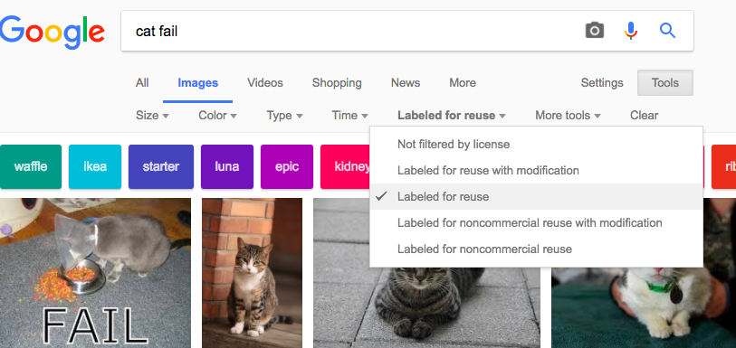

कॉपीराइट कानून के कारण, आप वेब (internet) पर मिलने वाली हर चीज का उपयोग नहीं कर सकते। यहां आप सीखेंगे कि उन छवियों को कैसे खोजना है, जिनका उपयोग आप कॉपीराइट कानूनों को तोड़े बिना अपने डिजिटल मेकिंग में कर सकते हैं।

### कॉपीराइट कानून को समझना

कॉपीराइट कानून को कलात्मक, साहित्यिक, संगीत, और नाटकीय रचनाकारों के कार्यों की रक्षा करने के लिए बनाया गया है जिससे कोई उनके काम का शोषण या दुरुपयोग न करें। इसका मतलब है कि कॉपीराइट कानून छवियों और कला कार्यों सहित ऑफ़लाइन और ऑनलाइन सभी तरह की सामग्रियों पर लागू होता है।

जो कोई भी मालिकों की अनुमति के बिना कॉपीराइट कार्य का उपयोग करता है, वह कॉपीराइट उल्लंघन का दोषी है। भले ही काम के बारे में बहुत सारी चीजें बदल दी गई हों, लिकेन यह कभी कभी सच होता हैं।

इंटरनेट पर कई चित्र कॉपीराइट द्वारा सुरक्षित हैं। कॉपीराइट प्रतीक ©, कॉपीराइट के लिए छवि में मौजूद होना अनिवार्य नहीं है।

यदि आप ऐसी छवि का उपयोग करना चाहते हैं जिसके लिए आपको अनुमति की आवश्यकता है, तो आपको सभी कॉपीराइट मालिकों से अनुमति लेनी होगी। अन्यथा, आप उन छवियों को खोज सकते हैं जो आपके लिए क्रिएटिव कॉमन्स लाइसेंसिंग के माध्यम से उपयोग करने के लिए स्वतंत्र हैं।

### Creative Commons

क्रिएटिव कॉमन्स लाइसेंसिंग एक छवि के निर्माता को यह चुनने की अनुमति देता है कि वह किन अनुमति को लोगों को मुफ्त में अपने काम के लिए देना चाहता हैं। क्रिएटिव कॉमन्स लाइसेंस के साथ आप अपने काम के सभी अधिकार, या उनमें से कुछ को दे सकते हैं। [क्रिएटिव कॉमन्स वेबसाइट](https://creativecommons.org/){: target = "_ blank"} पर एक ऑनलाइन फॉर्म है जो आपको यह पता लगाने में मदद करता है कि आप अपने अधिकारों में से कौन सा अधिकार देना चाहते हैं।

क्रिएटिव कॉमन्स लाइसेंसिंग से लोगों को उन छवियों को ढूंढना आसान हो जाता है, जिनके लिए उन्हें उपयोग करने की अनुमति है। क्रिएटिव कॉमन्स साइट पर, [खोज उपकरण](https://search.creativecommons.org/){: target = "_ blank"} है, जिसका उपयोग आप उन चित्रों को खोजने के लिए कर सकते हैं जिनके पास क्रिएटिव कॉमन्स लाइसेंस है। क्रिएटिव कॉमन्स लाइसेंस के तहत उपलब्ध छवियों को देखने के लिए एक और अच्छी जगह है [Wikimedia Commons](https://commons.wikimedia.org/wiki/Main_Page){: target = "_ blank"}।

कई खोज इंजन में क्रिएटिव कॉमन्स लाइसेंस के साथ छवियों की खोज करने का एक तरीका भी है, ताकि लोग कॉपीराइट कानून को तोड़ने से बच सकें।

### Google के साथ चित्र खोजना

यदि आप Google का उपयोग कर रहे हैं, तो अपने डिजिटल मेकिंग में उपयोग की जा सकने वाली छवि खोजने के लिए नीचे दिए गए निर्देशों का पालन करें:

+ Google छवियां पर जाएं और जो आप खोजना चाहते है वह टाइप करें। यहाँ, हमने `cat fail` को खोजा हैं:

+ **Search Tools**पर क्लिक करें, फिर **Usage Rights**, और**Labeled for reuse** का चयन करें।

+ एक छवि चुनें।

+ दोबारा से जाँचे की वह उपयोग करने के लिए स्वतंत्र हैं। आप चित्रों को उपयोग करने के लिए अधिक अधिकारों की जांच करने के लिए [TinEye](https://www.tineye.com/){:target="_ blank"} या [इमेज रेडर](https://www.imageraider.com/){:target="_ blank"} जैसे रिवर्स इमेज सर्च टूल का उपयोग कर सकते हैं। यहां, मैंने Google खोज से छवि के लिंक की प्रतिलिपि बनाई, और इसे TinEye में चिपकाया, और **Search**दबाया। जैसा कि आप देख सकते हैं, इंटरनेट पर कई बार (781!) छवि का उपयोग किया गया है, इसलिए यह संभावना है कि यह उपयोग करने के लिए स्वतंत्र है। यदि संदेह है, तो आपको मालिक को लिखना चाहिए और अनुमति के लिए पूछना चाहिए।

### ऑनलाइन सुरक्षा

आप को [गलती से एक छवि की खोज करते हैं जो आपको परेशान व निराश करती हैं](https://www.thinkuknow.co.uk/11_13/Need-advice/Things-you-see-online/){:target="_ blank"}, तब तुरंत अपना ब्राउज़र बंद करें और अपने बड़ों को बताइए।