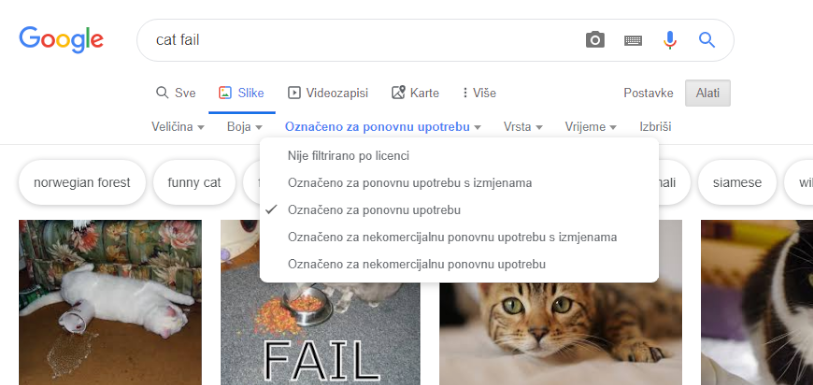

Zbog zakona o autorskim pravima ne možete koristiti sve što pronađete na webu. Ovdje ćete naučiti kako pronaći slike koje možete koristiti u digitalnoj izradi bez kršenja zakona o autorskim pravima.

### Razumijevanje zakona o autorskim pravima

Zakon o autorskim pravima namijenjen je zaštiti stvaralaca umjetničkih, književnih, glazbenih i dramskih djela od zlouporabe njihovih djela. To znači da se zakon o autorskim pravima odnosi na sve vrste materijala izvan mreže i na mreži, uključujući slike i umjetnička djela.

Svatko tko koristi autorsko djelo bez vlasnikovog odobrenja kriv je za kršenje autorskih prava. To je ponekad točno čak i ako se u djelu promijenilo mnogo toga.

Mnoge slike na internetu zaštićene su autorskim pravima. Simbol autorskih prava © ne mora biti prisutan na slici da bi postojala autorska prava.

Ako želite koristiti sliku za koju vam je potrebno dopuštenje, morati ćete dobiti dopuštenje od svih vlasnika autorskih prava. U protivnom možete pretraživati slike koje možete besplatno koristiti putem Creative Commons licenciranja.

### Creative Commons

Creative Commons licenciranje omogućuje kreatoru slike da odabere koja će dopuštenja ljudima besplatno dati za svoj rad. S licencom Creative Commons možete dati sva prava na svoj rad ili samo neka od njih. Na web stranici [Creative Commons](https://creativecommons.org/){:target="_blank"} postoji internetski obrazac koji vam pomaže da shvatite točno koja od vaših prava želite dati.

Creative Commons licenciranje ljudima olakšava pronalaženje slika za koje imaju dozvolu koristiti. Na Creative Commons web stranici nalazi se [alat za pretraživanje](https://search.creativecommons.org/){:target="_blank"} koji možete koristiti kako bi pronašli slike koje imaju licencu Creative Commons. Još jedno dobro mjesto za traženje slika dostupnih pod Creative Commons licencom je [Wikimedia Commons](https://commons.wikimedia.org/wiki/Main_Page){:target="_blank"}.

Mnoge tražilice također sadrže način pretraživanja slika s Creative Commons licencom, kako bi ljudi izbjegli kršenje zakona o autorskim pravima.

### Pretraživanje slika s Googleom

Ako koristite Google, slijedite upute u nastavku da biste pronašli sliku koju možete upotrijebiti u izradi digitalnih proizvoda:

+ Otvorite Google slike i upišite ono što tražite. Ovdje smo tražili `mačje failove`:

+ Kliknite **Alati za pretraživanje**, zatim **Prava korištenja**i odaberite **Označeno za ponovnu upotrebu**.

+ Odaberite sliku.

+ Dvaput provjerite je li je besplatno za korištenje. Možete upotrijebiti alat za obrnutu pretragu koristeći slike, poput [TinEye](https://www.tineye.com/){:target="_blank"} ili [Image Raider](https://www.imageraider.com/){:target="_blank"} da biste provjerili ima li daljnjih prava upotrebe. Kopirao sam poveznicu sa slike iz Google pretraživanja, zalijepio je u TinEye i pritisnuo **Search**. Kao što vidite, slika je korištena već mnogo puta (781!) Na cijelom internetu, tako da je vjerojatno slobodna za upotrebu. Ako imate dvojbe, pišite kreatoru slike i zatražite dopuštenje.

### Internetska sigurnost

Ako [slučajno otkrijete sliku koju možete pronaći traumatičnom](https://www.thinkuknow.co.uk/11_13/Need-advice/Things-you-see-online/){:target="_blank"}, zatvorite preglednik odmah i recite nekome odraslome.