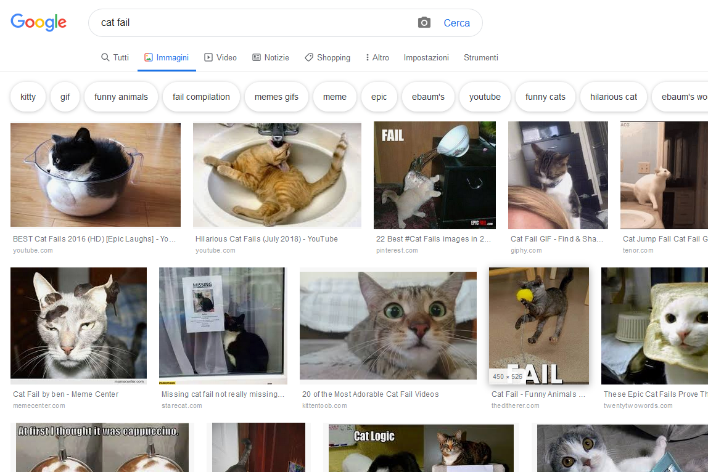

Per la legge sul copyright, non puoi utilizzare tutto ciò che trovi sul Web. Qui imparerai come trovare immagini che puoi usare nelle tue creazioni digitali senza infrangere le leggi sul copyright.

### Capire la legge sul copyright

La legge sul diritto d'autore è volta a proteggere i creatori di opere artistiche, letterarie, musicali e drammatiche ed evitare che il loro lavoro sia sfruttato in modo illecito. Ciò significa che la legge sul copyright si applica a tutti i tipi di materiali offline e online, comprese immagini e opere d'arte.

Chiunque utilizzi un'opera protetta da copyright senza l'autorizzazione del proprietario è colpevole di violazione del copyright. Questo a volte è vero anche se l'opera è stata modificata considerevolmente.

Molte immagini su Internet sono protette da copyright. Il simbolo del copyright © non necessariamente deve essere presente nell'immagine per confermarne l'esistenza.

Se si desidera utilizzare un'immagine per la quale è richiesta un'autorizzazione, è necessario ottenerla da tutti i proprietari del copyright. In alternativa, puoi cercare immagini liberamente utilizzabili con le licenze Creative Commons.

### Creative Commons

La licenza Creative Commons consente al creatore di un'immagine di selezionare le autorizzazioni che desidera concedere liberamente. Con la licenza Creative Commons puoi concedere tutti i diritti o solo alcuni di essi. Esiste un modulo online sul sito Web [Creative Commons](https://creativecommons.org/){:target="_ blank"} che ti aiuta a capire esattamente quali dei tuoi diritti puoi concedere.

Le licenze Creative Commons consentono alle persone di trovare più facilmente le immagini autorizzate per essere riutilizzate. Sul sito Creative Commons, è presente uno [strumento di ricerca ](https://search.creativecommons.org/){:target="_ blank"} che puoi utilizzare per trovare immagini con una licenza Creative Commons. Un altro buon posto per cercare immagini disponibili con una licenza Creative Commons è [Wikimedia Commons](https://commons.wikimedia.org/wiki/Main_Page){:target="_ blank"}.

Molti motori di ricerca offrono anche un'impostazione per cercare immagini con una licenza Creative Commons, in modo da impedire alle persone di violare la legge sul copyright.

### Ricerca di immagini con Google

Se stai utilizzando Google, segui le istruzioni di seguito per trovare un'immagine che puoi utilizzare nei tuoi elaborati digitali:

+ Vai su Google Immagini e digita ciò che stai cercando. Qui, abbiamo cercato `cat fail`:

+ Fai clic su **Strumenti di ricerca**, quindi **Diritti di utilizzo** e seleziona **Contrassegnate per essere riutilizzate**.

+ Scegli un'immagine.

+ Ricontrolla se è liberamente utilizzabile. È possibile utilizzare uno strumento di ricerca di immagini inversa come [TinEye](https://www.tineye.com/){:target="_ blank"} o [Image Raider](https://www.imageraider.com/){:target="_ blank"} per verificare eventuali ulteriori diritti d'uso. Qui, ho copiato il collegamento dell'immagine dalla ricerca di Google, incollato in TinEye e premuto **Cerca**. Come puoi vedere, l'immagine è stata utilizzata molte volte (781!) su Internet, quindi è probabile che sia gratuita. In caso di dubbio, è necessario scrivere al proprietario e chiedere l'autorizzazione.

### Sicurezza online

Se [scopri accidentalmente un'immagine che trovi sconvolgente](https://www.thinkuknow.co.uk/11_13/Need-advice/Things-you-see-online/){:target="_ blank"}, chiudi immediatamente il browser e informa un adulto.