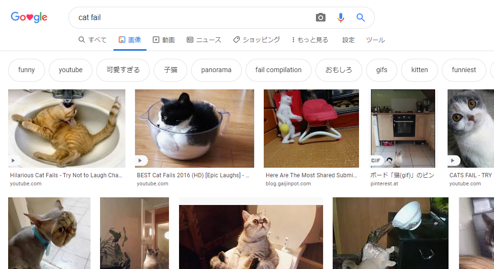
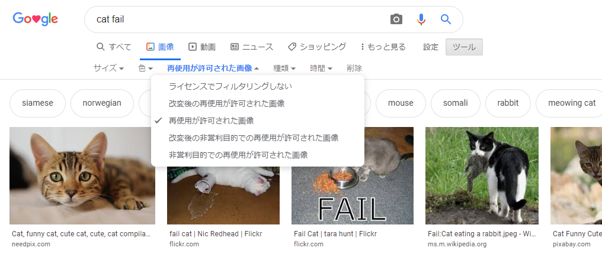

著作権法 (ちょさくけんほう) により、インターネット上で見つけたものすべてを使用することはできません。 ここでは、著作権法に違反 (いはん) することなくデジタル工作 (電子工作やプログラミング) で使用できる画像を見つける方法を学びます。

### 著作権法を理解 (りかい) する

著作権法は、芸術 (げいじゅつ) 、文学、音楽、および劇 (げき) 作品を作った人が、その作品を不当に使用されたり、悪用されたりしないように保護 (ほご) することを目的 (もくてき) としています。 This means that copyright law applies to all manner of materials offline and online, including images and art work.

Anyone who uses a copyrighted work without the owners' permission is guilty of copyright infringement. This is sometimes true even if a lot of things have been changed about the work.

Many images on the internet are protected by copyright. The copyright symbol © does not have to be present in the image for copyright to exist.

If you want to use an image for which you require permission, you will need to obtain permission from all the copyright owners. Otherwise, you can search for images that are free for you to use through Creative Commons licensing.

### Creative Commons

Creative Commons licensing allows the creator of an image to select which permissions they want to give to people to their work for free. With Creative Commons licensing you can give away all rights to your work, or just some of them. There is an online form on the [Creative Commons website](https://creativecommons.org/){:target="_blank"} that helps you to figure out exactly which of your rights you want to give away.

Creative Commons licensing makes it easier for people to find images that they have permission to use. On the Creative Commons site, there is a [search tool](https://search.creativecommons.org/){:target="_blank"} you can use to find images that have a Creative Commons license. Another good place to look for images available under a Creative Commons license is [Wikimedia Commons](https://commons.wikimedia.org/wiki/Main_Page){:target="_blank"}.

Many search engines also feature a way to search for images with a Creative Commons license, so that people can avoid breaking copyright law.

### Searching for images with Google

If you are using Google, follow the instructions below to find an image you can use in your digital making:

+ Go to Google Images and type in what you are searching for. Here, we searched for `cat fail`:

+ Click on **Search Tools**, then **Usage Rights**, and select **Labeled for reuse**.

+ Choose an image.

+ Double-check whether it is free to use. You can use a reverse image search tool like [TinEye](https://www.tineye.com/){:target="_blank"} or [Image Raider](https://www.imageraider.com/){:target="_blank"} to check for any further usage rights. Here, I copied the image link from the Google search, pasted it into TinEye, and pressed **Search**. As you can see, the image has been used many times (781!) all over the internet, so it is likely that it is free to use. If in doubt, you should write to the owner and ask for permission.

### Online safety

If you [accidentally discover an image you find upsetting](https://www.thinkuknow.co.uk/11_13/Need-advice/Things-you-see-online/){:target="_blank"}, close your browser immediately and tell an adult.