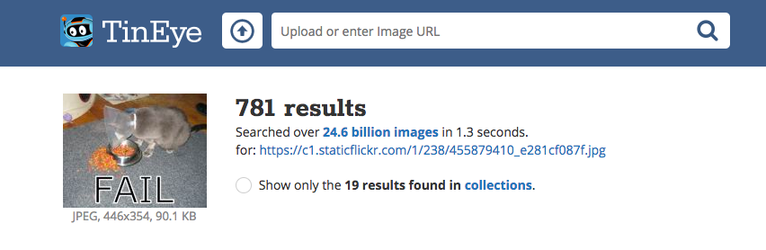

著作権法 (ちょさくけんほう) により、インターネット上で見つけたものすべてを使用することはできません。 ここでは、著作権法に違反 (いはん) することなくデジタル工作 (電子工作やプログラミング) で使用できる画像を見つける方法を学びます。

### 著作権法を理解 (りかい) する

著作権法は、芸術 (げいじゅつ) 、文学、音楽、および劇 (げき) 作品を作った人が、その作品を不当に使用されたり、悪用されたりしないように保護 (ほご) することを目的 (もくてき) としています。 これは著作権法画像や芸術作品を含む、オフラインおよびオンラインのあらゆる種類 (しゅるい) のマテリアルに適用 (てきよう) されるということを意味します。

所有者の許可なしに著作権で保護 (ほご) された作品を使用した人は、著作権侵害 (しんがい) の罪 (つみ) に問われます。 これは、作品を大きく改変 (かいへん) した場合でも当てはまる場合があります。

インターネット上の多くの画像は著作権によって保護されています。 画像に著作権があることをしめすための著作権記号©がなくても、著作権はあります。

許可が必要 (ひつよう) な画像を使用する場合は、すべての著作権所有者から許可をえる必要があります。 それができない場合は、クリエイティブ・コモンズ・ライセンスによって無料 (むりょう) で使用できるようになっている画像をさがします。

### クリエイティブ・コモンズ

クリエイティブ・コモンズ・ライセンスでは、画像の作成者は、自分の作品にどのような権限 (けんげん) をあたえるかを自由に決めることができます。 クリエイティブ・コモンズ・ライセンスを使用すると、作品のすべての権利 (けんり) 、またはその一部のみを譲渡 (じょうと) できます。 [クリエイティブ・コモンズのウェブサイト](https://creativecommons.org/){:target="_ blank"} (英語、フォームは日本語) にはオンラインフォームがあり、どの権利を譲渡するかをはっきりと把握 (はあく) するのに役立ちます。

クリエイティブ・コモンズ・ライセンスにより、使用許可のある画像をかんたんに見つけることができます。 クリエイティブ・コモンズのサイトには、 クリエイティブ・コモンズ・ライセンスのある画像をさがすための[検索 (けんさく) ツール](https://search.creativecommons.org/){:target="_ blank"} (英語) があります。 [ウィキメディア・コモンズ](https://commons.wikimedia.org/wiki/Main_Page){:target="_ blank"}でも、クリエイティブ・コモンズ・ライセンスの下で使用できる画像をさがすことができます。

検索エンジンの多くではクリエイティブ・コモンズ・ライセンスのある画像を検索できるため、著作権法違反をさけることができます。

### Google で画像を検索する

Google を使用している場合は、以下の手順でデジタル工作で使える画像をさがしてみてください。

+ Google画像検索にアクセスして、キーワードを入力します。 ここでは、 `cat fail` (ネコ　失敗 (しっぱい)) を検索しました。

+ **ツール**から**ライセンス**をクリックし、 **再使用が許可された画像**をえらびます。

+ 画像をえらびましょう。

+ 無料で使用できるかどうかをもう一度たしかめましょう。 [TinEye](https://www.tineye.com/){:target="_ blank"} (英語) や [Image Raider](https://www.imageraider.com/){:target="_ blank"} (英語) など、画像の逆 (ぎゃく) 検索ツールを使えば、それ以上 (いじょう) の使用権があるかどうかをたしかめることができます。 ここでは、Google検索から画像リンクをコピーしてTinEyeに貼り付け (はりつけ)、 **むしめがねのアイコン** (検索ボタン) をクリックしました。 ごらんのとおり、画像はインターネット上で何度も（781回も！）使用されているため、無料で使用できると思われます。 はっきりと分からない場合は、所有者に手紙を書いて許可をもとめる必要があります。

### インターネットを安全に使う

[いやな画像を見てしまった](https://www.thinkuknow.co.uk/11_13/Need-advice/Things-you-see-online/){:target="_blank"} (英語) 場合は、すぐにブラウザを閉じて、大人の人に知らせてください。