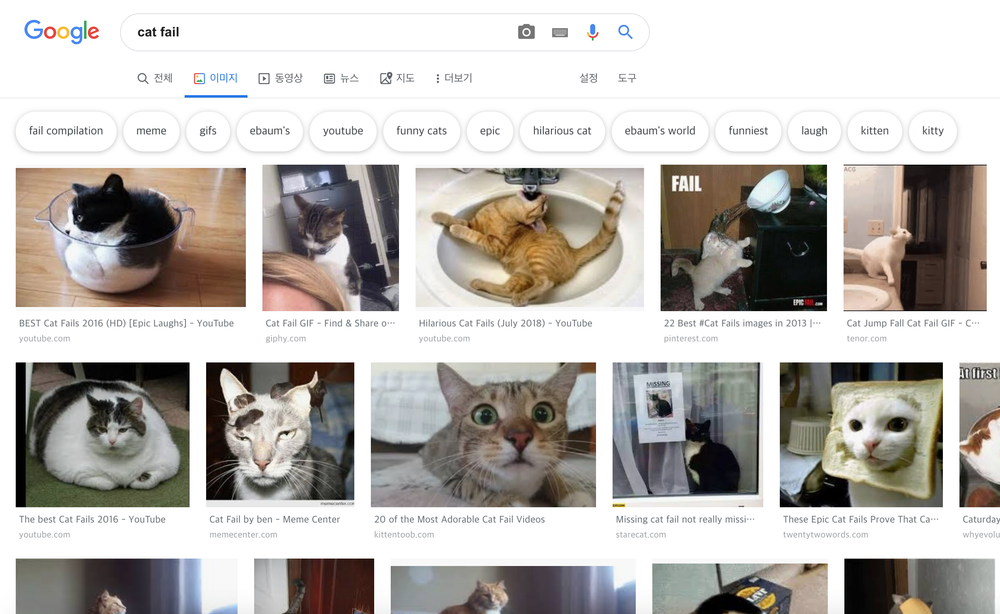
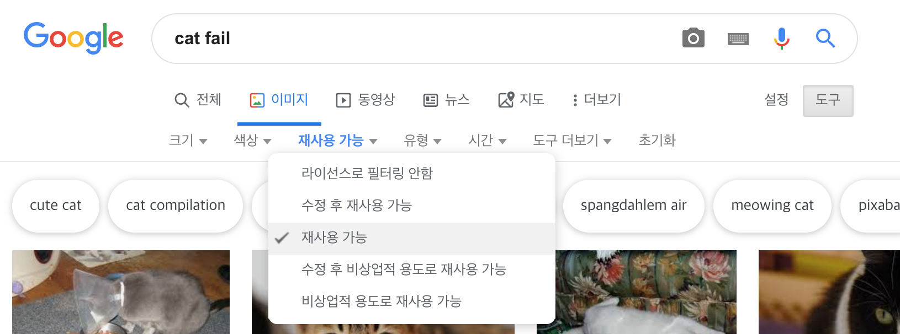
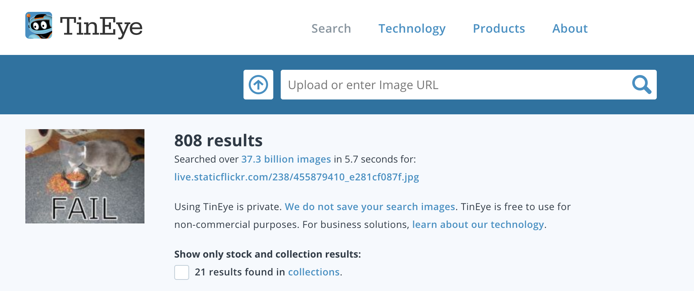

저작권법으로 인해 웹에서 찾은 모든 것을 사용할 수는 없습니다. 여기에서는 저작권법을 위반하지 않고 디지털 제작에 사용할 수있는 이미지를 찾는 방법을 배웁니다.

### 저작권법 이해

저작권법은 예술적, 문학적, 음악적 작품을 제작 한 사람이 자신의 저작물을 악용하거나 오용하지 못하도록 보호하기 위해 고안되었습니다. 이는 저작권법이 이미지 및 예술 작품을 포함하여 오프라인 및 온라인의 모든 자료에 적용됨을 의미합니다.

소유자의 허락없이 저작권이있는 저작물을 사용하는 사람은 저작권을 침해합니다. 작품에 대해 많은 것들이 바뀌었더라도 이것은 때때로 사실입니다.

인터넷상의 많은 이미지는 저작권으로 보호됩니다. 저작권이 존재하기 위해 꼭 이미지에 저작권 기호 ©가 있을 필요는 없습니다. © 기호가 없는 이미지도 모두 저작권으로 보호됩니다.

허가가 필요한 이미지를 사용하려면 모든 저작권 소유자로부터 허가를 받아야 합니다. 그렇지 않으면 Creative Commons 라이센스를 통해 무료로 사용할 수있는 이미지를 검색 할 수 있습니다.

### 크리에이티브 커먼즈

Creative Commons 라이센싱을 사용하면 이미지 작성자가 무료로 자신의 작품에 사람들에게 부여 할 권한을 선택할 수 있습니다. Creative Commons 라이센싱을 사용하면 작업물에 대한 모든 권한을 부여하거나, 일부만 부여할 수 있습니다. [크리에이티브 커먼즈 웹 사이트](https://creativecommons.org/){:target="_ blank"}에 온라인 양식이 있습니다. 부여하려는 권리를 정확히 파악하는 데 도움이 됩니다.

Creative Commons 라이센스를 사용하면 사용 권한이 있는 이미지를 쉽게 찾을 수 있습니다. 크리에이티브 커먼즈 사이트의 [검색 도구](https://search.creativecommons.org/){:target="_blank"} 를 활용하면, 당신은 Creative Commons 라이센스를 가진 이미지를 찾을 수 있습니다. Creative Commons 라이센스에 따라 사용 가능한 이미지를 찾는 또 다른 좋은 곳은 [Wikimedia Commons](https://commons.wikimedia.org/wiki/Main_Page){:target="_blank"}입니다.

많은 검색 엔진에는 Creative Commons 라이센스로 이미지를 검색하는 방법도 있으며, 사람들이 저작권법을 위반하지 않도록 할 수 있습니다.

### Google로 이미지 검색

Google을 사용하는 경우 아래 설명에 따라 디지털 제작에 사용할 수있는 이미지를 찾으십시오.

+ Google 이미지로 이동하여 검색하고자 하는 것을 입력합니다. 여기에서는 `cat fail`을 검색했습니다.

+ **검색 도구**를 클릭 한 다음 **사용 권한**을 클릭하고 **재사용 가능**을 선택하십시오.

+ 이미지를 선택하십시오.

+ 자유롭게 사용 가능한지 다시 확인하십시오. [TinEye](https://www.tineye.com/){:target="_blank"} 또는 [Image Raider](https://www.imageraider.com/){:target="_ blank"}과 같은 역방향 이미지 검색 도구를 사용하여 추가 사용 권한을 확인할 수 있습니다. 여기에서 Google 검색에서 이미지 링크를 복사하여 TinEye에 붙여 넣고 **검색**을 누릅니다. 보시다시피, 이 이미지는 인터넷 전체에서 여러 번 사용되었으므로 (808!) 무료로 사용할 수 있습니다. 확실치 않은 경우 소유자에게 서면으로 허가를 요청해야합니다.

### 온라인 안전

만약 [부적절한 내용의 이미지](https://www.thinkuknow.co.uk/11_13/Need-advice/Things-you-see-online/){:target="_blank"}를 발견 한 경우 브라우저를 즉시 닫고 성인에게 알리십시오.