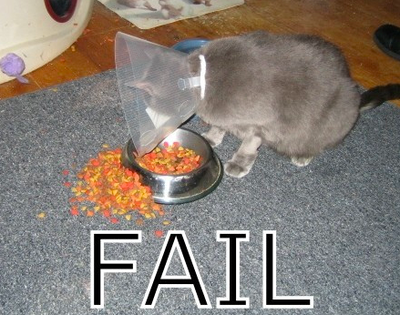
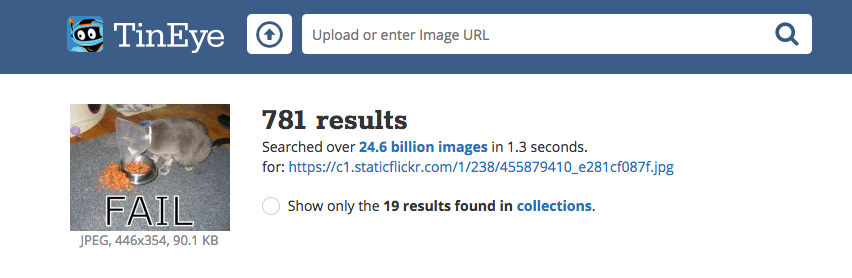

कॉपीराइट कायद्यामुळे आपण वेबवर आपल्याला सापडत असलेली प्रत्येक गोष्ट वापरू शकत नाही. येथे आपण कॉपीराइटचे कायदे न तोडता आपल्या डिजिटल बनवताना वापरू शकणार्‍या इमेजेस कशा शोधायच्या हे शिकू.

### कॉपीराइट कायदा समजून घेत आहे

कॉपीराइट कायदा कलात्मक, साहित्यिक, वाद्य आणि नाट्यमय कामांच्या निर्मात्यांचे त्यांच्या कार्याचा गैरवापर किंवा गैरवापर करण्यापासून संरक्षण करण्यासाठी बनविला गेला आहे. याचा अर्थ असा की कॉपीराइट कायदा images आणि कला साहित्यासह, ऑफलाइन आणि ऑनलाइन सर्व प्रकारच्या सामग्रीवर लागू आहे.

जो कोणी मालकांच्या परवानगीशिवाय कॉपीराइट केलेले कार्य वापरतो तो कॉपीराइट उल्लंघनासाठी दोषी आहे. कामाबद्दल बर्‍याच गोष्टी बदलल्या गेल्या तरीसुद्धा हे खरं आहे.

इंटरनेटवरील बर्‍याच images कॉपीराइटद्वारे संरक्षित केल्या आहेत. कॉपीराइट अस्तित्त्वात असण्यासाठी इमेजमध्ये कॉपीराइट चिन्ह असणे आवश्यक नाही.

आपल्याला ज्या imageसाठी परवानगी आवश्यक आहे ती वापरू इच्छित असल्यास, आपल्याला सर्व कॉपीराइट मालकांकडून परवानगी घेणे आवश्यक आहे. अन्यथा, आपण क्रिएटिव्ह कॉमन्स परवान्याद्वारे वापरण्यासाठी विनामूल्य असलेल्या image शोधू शकता.

### क्रिएटिव्ह कॉमन्स

क्रिएटिव्ह कॉमन्स लायसन्सिंग इमेज निर्मात्यास लोकांना त्यांच्या कामासाठी विनामूल्य परवानगी देऊ इच्छित असलेल्या परवानग्यांची निवड करण्यास परवानगी देते. क्रिएटिव्ह कॉमन्स परवान्यासह आपण आपल्या कार्याचे किंवा त्यापैकी काही अधिकारांचे सर्व हक्क देऊ शकता.  क्रिएटिव्ह कॉमन्स वेबसाइट [Creative Commons website](https://creativecommons.org/){:target="_blank"} जे आपल्याला आपला कोणता अधिकार सोडायचा हे शोधण्यात आपल्याला मदत करते. 

क्रिएटिव्ह कॉमन्स परवाना लोकांना वापरण्याची परवानगी असलेल्या image शोधणे सुलभ करते. क्रिएटिव्ह कॉमन्स साइटवर [search tool](https://search.creativecommons.org/){:target="_blank"} आहे आपण क्रिएटिव्ह कॉमन्स परवाना असलेल्या Images शोधण्यासाठी वापरू शकता. क्रिएटिव्ह कॉमन्स परवान्याअंतर्गत उपलब्ध इमेज शोधण्यासाठी आणखी एक चांगली जागा म्हणजे [Wikimedia Commons](https://commons.wikimedia.org/wiki/Main_Page){:target="_blank"}.

बरीच सर्च इंजिन क्रिएटिव्ह कॉमन्स परवान्यासह image शोधण्याचा एक मार्ग देखील दर्शवितात, जेणेकरून लोक कॉपीराइट कायदा मोडणे टाळतील.

### Google सह images शोधत आहे

आपण Google वापरत असल्यास, आपल्या डिजिटल मेकिंगमध्ये आपण वापरू शकता अशी एखादी image शोधण्यासाठी खालील सूचनांचे अनुसरण करा:

+ Google इमेजेस मध्ये जा आणि आपण ज्याचा शोध घेत आहात ते टाइप करा. येथे, आम्ही `cat fail` शोधले:

+ **Search Tools** वर क्लिक करा, नंतर **Usage Rights** वर क्लिक करा आणि **Labeled for reuse** निवडा.

+ एक image निवडा.

+ ते वापरण्यास free आहे की नाही याची दोनदा तपासणी करा. आपण पुढील वापर अधिकार तपासण्यासाठी [TinEye](https://www.tineye.com/){:target="_blank"} किंवा [image राइडर](https://www.imageraider.com/){:target="_blank"} यासारखे उलट प्रतिमेचे शोध साधन वापरू शकता. येथे मी Google शोधातून image link कॉपी केला, तो TinEye मध्ये पेस्ट केला आणि **Search** दाबले. आपण पहातच आहात, image संपूर्ण इंटरनेटवर बर्‍याच वेळा वापरली गेली आहे (781!), त्यामुळे ती वापरण्यास उपलब्ध आहे. शंका असल्यास आपण मालकाला विचारून परवानगी मागितली पाहिजे.

### ऑनलाइन सुरक्षा

आपण [चुकून आपल्याला एखादी image अस्वस्थ करणारी वाटल्यास](https://www.thinkuknow.co.uk/11_13/Need-advice/Things-you-see-online/){:target="_blank"} आपला ब्राउझर त्वरित बंद करा आणि एखाद्या प्रौढ व्यक्तीस सांगा.
