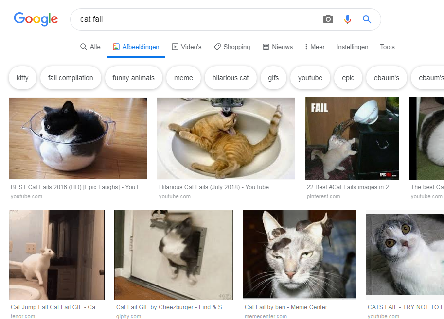
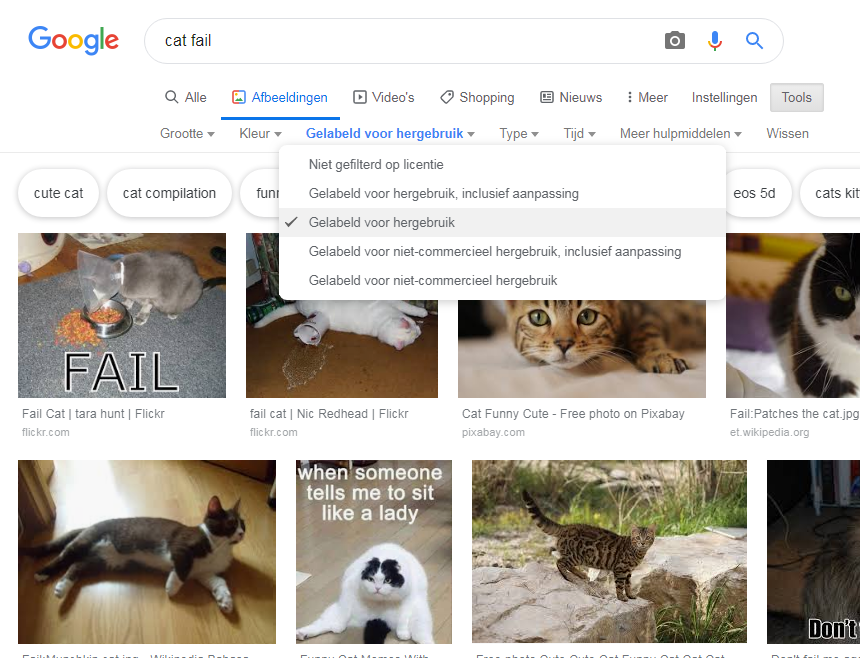

Vanwege de auteursrechtwetgeving mag je niet alles gebruiken wat je op internet vindt. Hier leer je hoe je afbeeldingen kunt vinden die je kunt gebruiken zonder de auteursrechten te schenden.

### Inzicht in auteursrechten

Het auteursrecht is bedoeld om makers van artistieke, literaire, muzikale en dramatische werken te beschermen tegen uitbuiting of misbruik van hun werk. Dit betekent dat de auteursrechtwetgeving van toepassing is op alle soorten materiaal offline en online, inclusief afbeeldingen en kunstwerken.

Iedereen die een auteursrechtelijk beschermd werk gebruikt zonder toestemming van de eigenaar, maakt zich schuldig aan inbreuk op het auteursrecht. Dit is soms waar zelfs als er veel dingen zijn veranderd aan het werk.

Veel afbeeldingen op internet zijn auteursrechtelijk beschermd. Het auteursrechtsymbool © hoeft niet aanwezig te zijn in de afbeelding om het auteursrecht te laten bestaan.

Als je een afbeelding wilt gebruiken waarvoor je toestemming nodig hebt, moet je toestemming krijgen van alle auteursrechteigenaren. Anders kun je zoeken naar afbeeldingen die je gratis kunt gebruiken via Creative Commons-licenties.

### Creative Commons

Met Creative Commons-licenties kan de maker van een afbeelding selecteren welke machtigingen hij mensen gratis voor zijn werk wil geven. Met Creative Commons-licenties kunt je alle rechten op jouw werk, of slechts enkele weggeven. Er is een online formulier op de [Creative Commons-website](https://creativecommons.org/){:target="_blank"} waarmee je precies kunt bepalen welke van jouw rechten je wilt weggeven.

Met Creative Commons-licenties kunnen mensen gemakkelijker afbeeldingen vinden die ze mogen gebruiken. Op de Creative Commons-site is een [zoektool](https://search.creativecommons.org/){:target="_blank"} die je kunt gebruiken om afbeeldingen te vinden die een Creative Commons-licentie hebben. Een andere goede plaats om te zoeken naar afbeeldingen die beschikbaar zijn onder een Creative Commons-licentie is [Wikimedia Commons](https://commons.wikimedia.org/wiki/Main_Page){:target="_blank"}.

Veel zoekmachines bieden ook een manier om naar afbeeldingen te zoeken met een Creative Commons-licentie, zodat mensen kunnen voorkomen dat ze de auteursrechtwetgeving overtreden.

### Zoeken naar afbeeldingen met Google

Als je Google gebruikt, volg je de onderstaande instructies om een afbeelding te vinden die je voor jouw digitale productie kunt gebruiken:

+ Ga naar Google Afbeeldingen en typ wat je zoekt. Hier hebben we gezocht naar `cat fail`:

+ Klik op **Tools**en vervolgens op **Gebruiksrechten** en selecteer **Gelabeld voor hergebruik**.

+ Kies een afbeelding.

+ Controleer nogmaals of het vrij te gebruiken is. Je kunt een tool zoals [TinEye](https://www.tineye.com/){:target="_blank"} of [Image Raider](https://www.imageraider.com/){:target="_blank"} voor het zoeken naar afbeeldingen gebruiken om te controleren op verdere gebruiksrechten. Hier heb ik de afbeeldingslink van de Google-zoekopdracht gekopieerd, in TinEye geplakt en op **Zoeken** gedrukt. Zoals je kunt zien, is de afbeelding vele malen (781!) op het hele internet gebruikt, dus het is waarschijnlijk dat deze vrij te gebruiken is. In geval van twijfel moet je naar de eigenaar schrijven en toestemming vragen.

### Online veiligheid

Als je [per ongeluk een afbeelding ontdekt die je storend vindt](https://www.thinkuknow.co.uk/11_13/Need-advice/Things-you-see-online/){:target="_blank"}, sluit je browser onmiddellijk en vertel het een volwassene.