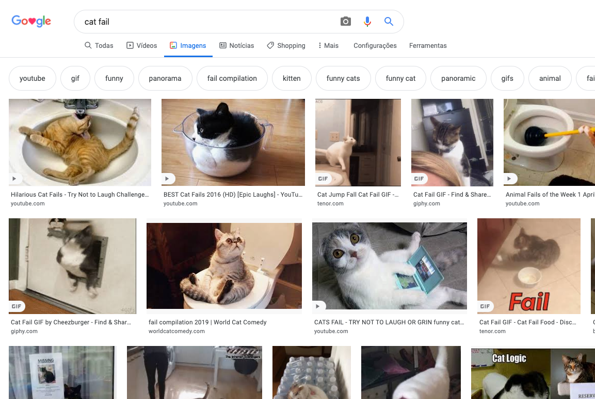
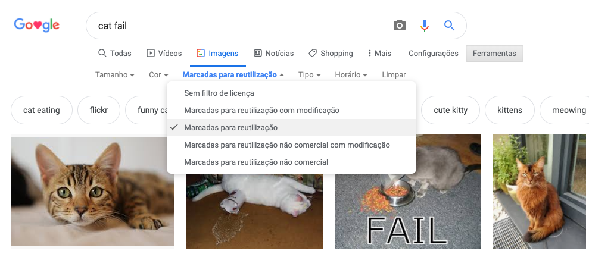

Por causa da lei de direitos autorais, você não pode usar tudo o que encontrar na web. Aqui você aprenderá a encontrar imagens que você pode usar na sua criação digital sem violar as leis de direitos autorais.

### Entendendo a lei de direitos autorais

A lei de direitos autorais é projetada para proteger os criadores de obras artísticas, literárias, musicais e dramáticas contra a exploração ou uso indevido de seu trabalho. Isso significa que a lei de direitos autorais se aplica a todos os tipos de materiais offline e online, incluindo imagens e obras de arte.

Qualquer pessoa que use uma obra protegida por direitos autorais sem a permissão dos proprietários é culpada de violação de direitos autorais. Isso às vezes é verdade, mesmo que muitas coisas tenham sido alteradas sobre o trabalho.

Muitas imagens na internet são protegidas por direitos autorais. O símbolo de direitos autorais © não precisa estar presente na imagem para que os direitos autorais existam.

Se você deseja usar uma imagem para a qual precisa de permissão, precisará obter permissão de todos os proprietários dos direitos autorais. Caso contrário, você pode procurar por imagens gratuitas para uso através do licenciamento Creative Commons.

### Creative Commons

O licenciamento da Creative Commons permite que o criador de uma imagem selecione quais permissões de seu trabalho deseja conceder gratuitamente às pessoas. Com o licenciamento da Creative Commons, você pode dar todos os direitos do seu trabalho, ou apenas alguns deles. Existe um formulário online no site da [Creative Commons](https://creativecommons.org/){:target="_blank"} que ajuda você a descobrir exatamente quais dos seus direitos você deseja ceder.

O licenciamento da Creative Commons facilita a localização de imagens que as pessoas têm permissão para usar. No site da Creative Commons, há uma [ferramenta de pesquisa](https://search.creativecommons.org/){: target="_blank"} que você pode usar para encontrar imagens que têm uma licença Creative Commons. Outro bom lugar para procurar imagens disponíveis sob uma licença Creative Commons é [Wikimedia Commons](https://commons.wikimedia.org/wiki/Main_Page){:target="_ blank"}.

Muitos mecanismos de pesquisa também apresentam uma maneira de pesquisar imagens com uma licença Creative Commons, para que as pessoas possam evitar violar a lei de direitos autorais.

### Procurando imagens com o Google

Se você estiver usando o Google, siga as instruções abaixo para encontrar uma imagem que você pode usar em sua criação digital:

+ Vá para o Imagens do Google e digite o que você está procurando. Aqui, procuramos por `cat fail`:

+ Clique em **Ferramentas**, depois em **Direitos de uso** e selecione **Marcadas para reutilização**.

+ Escolha uma imagem.

+ Verifique novamente se é de uso gratuito. Você pode usar uma ferramenta de pesquisa de imagem reversa como [TinEye](https://www.tineye.com/){:target="_blank"} ou [Image Raider](https://www.imageraider.com/){:target="_blank"} para verificar quaisquer outros direitos de uso. Aqui copiei o link da imagem da pesquisa do Google, colei no TinEye e pressionei **Search**. Como você pode ver, a imagem tem sido usada várias vezes (781!) em toda a Internet, então é provável que seja de uso gratuito. Em caso de dúvida, você deve escrever para o proprietário e pedir permissão.

### Segurança online

Se você [acidentalmente descobrir uma imagem que achar perturbadora](https://www.thinkuknow.co.uk/11_13/Need-advice/Things-you-see-online/){:target="_blank"}, feche seu navegador imediatamente e conte para um adulto.