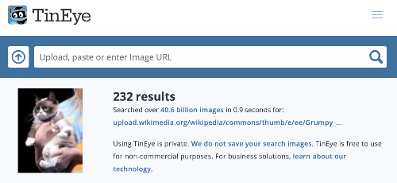

Из-за закона об авторских правах, ты не можешь использовать все, что ты найдешь в Интернете. Здесь ты узнаешь, как найти изображения, которые ты можешь использовать в своей работе, не нарушая законов об авторских правах.

### Понимание закона об авторском праве

Закон об авторском праве предназначен для защиты авторов художественных, литературных, музыкальных и драматических произведений от эксплуатации или неправомерного использования. Это означает, что закон об авторском праве применяется ко всем видам материалов в автономном режиме и онлайн, включая изображения и художественные работы.

Любой, кто использует защищенное авторским правом произведение без разрешения владельцев, виновен в нарушении авторских прав. Это иногда также верно, даже если в работе было много изменений.

Многие изображения в Интернете защищены авторским правом. Символ авторского права © не обязательно должен присутствовать в изображении, чтобы авторское право было применимо.

Если ты хочешь использовать изображение, на которое тебе требуется разрешение, тебе необходимо получить разрешение от всех владельцев авторских прав. Иначе ты должен искать изображения, которые ты можешь использовать бесплатно по лицензии Creative Commons.

### Creative Commons

Лицензирование Creative Commons позволяет создателю изображения выбирать, какие разрешения они хотят дать людям для их работы бесплатно. С лицензированием Creative Commons ты можешь передать все права на твою работу или только некоторые из них. На [сайте Creative Commons](https://creativecommons.org/){:target="_blank"} есть онлайн-форма, которая поможет тебе точно определить, какие из твоих прав ты желаешь передать.

Лицензирование Creative Commons облегчает людям поиск изображений, на которые у них есть разрешение. На сайте Creative Commons есть [инструмент поиска](https://search.creativecommons.org/){:target="_blank"}, который ты можешь использовать для поиска изображений с лицензией Creative Commons. Еще одно хорошее место для поиска изображений под лицензией Creative Commons – это [Wikimedia Commons](https://commons.wikimedia.org/wiki/Main_Page){:target="_blank"}.

Многие поисковые системы также имеют возможность искать изображения с лицензией Creative Commons, чтобы люди могли избежать нарушения авторского права.

### Поиск изображений с помощью Google

Если ты используешь Google, следуйте приведенным ниже инструкциям, чтобы найти изображение, которое ты можешь использовать в своей работе:

+ Перейдите в Google Images и введите то, что ты ищете. Здесь мы искали `грампи кэт`:

+ Нажми на **Инструменты**, затем на **Права использования** и выбери **С лицензией на использование**.

+ Выбери изображение.

+ Дважды проверь, является ли оно свободным для использования. Вы можете использовать инструмент обратного поиска, например, [TinEye](https://www.tineye.com/){:target="_blank"} или [Image Raider](https://www.imageraider.com/){:target="_blank"} для проверки любых дальнейших прав использования. Здесь я скопировал ссылку на изображение из поиска Google, вставил ее в TinEye и нажал **Поиск**. Как ты видишь, изображение использовалось много раз (232!) по всему Интернету, поэтому вполне вероятно, что оно бесплатное. Если ты сомневаешься, ты должен написать владельцу и попросить разрешения.

### Безопасность в Интернете

Если ты [случайно обнаружил изображение, которое тебя расстраивает](https://www.thinkuknow.co.uk/11_13/Need-advice/Things-you-see-online/){:target="_blank"}, немедленно закрой браузер и сообщи об этом взрослому.