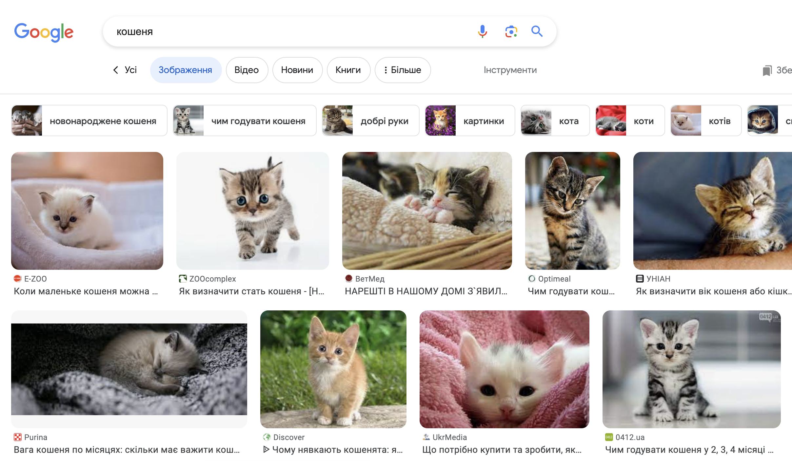
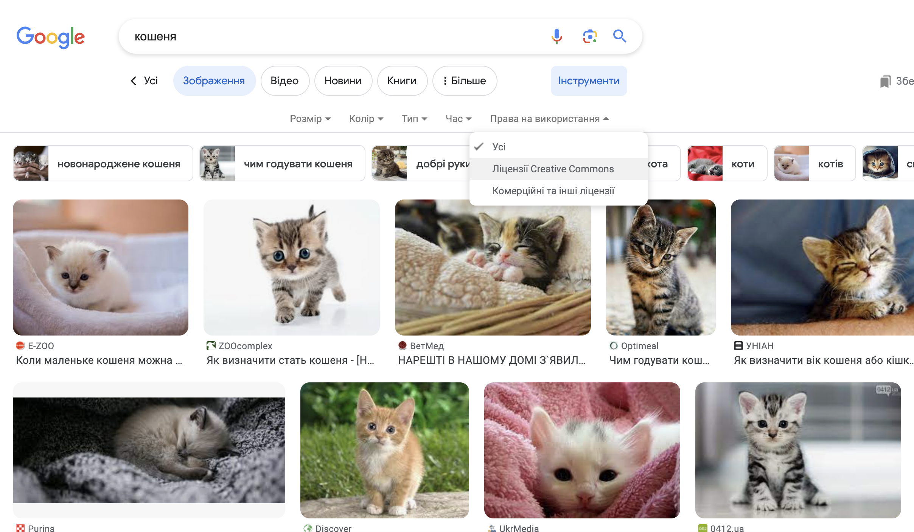
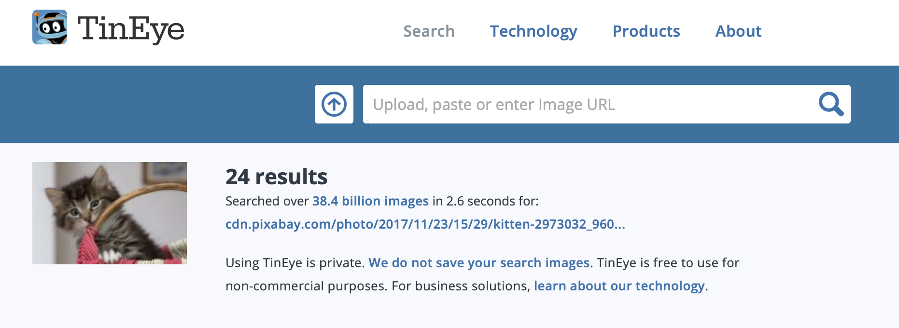

Через закон про авторські права ти не можеш використовувати все, що знаходиш в Інтернеті. Тут ти дізнаєшся про те, як знаходити зображення, які можна використовувати у цифрових продуктах без порушення законів про авторські права.

### Розуміння законодавства про авторські права

Закон про авторські права покликаний захищати творців художніх, літературних, музичних та драматичних творів від неправомірного використання результатів їхньої роботи. Це означає, що закон про авторські права поширюється на всі види цифрових та нецифрових матеріалів, включаючи зображення та інші твори мистецтва.

Кожен, хто використовує твори, захищені авторським правом, без дозволу їх власників, порушує авторські права. Часто це працює, навіть якщо оригінальний твір було значно змінено.

Багато зображень в Інтернеті захищені авторським правом. Символ авторських прав © не обов’язково має бути присутнім на зображенні, щоб на нього розповсюджувалися чиїсь авторські права.

Якщо ти хочеш використати зображення, для якого потрібен дозвіл, тобі необхідно буде його отримати від усіх, хто володіє авторськими правами на це зображення. Ти також можеш знайти зображення, які можна вільно використовувати, за допомогою ліцензій Creative Commons.

### Creative Commons

Ліцензування Creative Commons дає можливість автору зображення вказати, які права на нього безкоштовно надаватимуться іншим людям. Через ліцензуванню Creative Commons можна надавати всі права на твір або лише деякі з них. На [вебсайті Creative Commons](https://creativecommons.org/){:target="_blank"} є онлайн-форма, яка допоможе розібратися, які саме права ти хочеш надати.

Ліцензування Creative Commons полегшує людям пошук зображень, які вони можуть використовувати. На сайті Creative Commons є [інструмент пошуку](https://search.creativecommons.org/){:target="_blank"}, який ти можеш використовувати, щоб знайти зображення із ліцензією Creative Commons. Ще одним хорошим місцем для пошуку зображень, доступних за ліцензіями Creative Commons, є [Wikimedia Commons](https://commons.wikimedia.org/wiki/Main_Page){:target="_blank"}.

Також у багатьох пошукових системах є спосіб пошуку зображень з ліцензією Creative Commons, щоб люди могли уникнути порушення закону про авторські права.

### Пошук зображень за допомогою Google

Якщо ти використовуєш Google, дотримуйся наведених нижче вказівок для пошуку зображень, які можна використовувати в своїх цифрових творах:

+ Перейди до пошуку зображень Google і введи те, що шукаєш. Наприклад, ми шукаємо `кошеня`:

+ Клацни **Інструменти**, а потім **Права на використання** та вибери **Ліцензії Creative Commons**.

+ Вибери якесь зображення.

+ Перевір, що його можна вільно використовувати. Ти можеш скористатися інструментом зворотнього пошуку зображень, наприклад [TinEye](https://www.tineye.com/){:target="_blank"} або [Image Raider](https://www.imageraider.com/){:target="_blank"}, щоб перевірити будь-які подальші права використання. Тут ми скопіювали посилання на зображення з пошуку Google, вставили його в TinEye і натиснули **Пошук**. Як бачиш, зображення використовувалося багато разів (24!) по всьому Інтернету, тому, дуже ймовірно, що воно є безкоштовним. У випадку сумнівів, тобі слід написати власнику і запитати дозволу.

### Безпека в Інтернеті

Якщо ти [випадково побачив (-ла) зображення, яке тебе засмутило](https://www.thinkuknow.co.uk/11_13/Need-advice/Things-you-see-online/){:target="_blank"}, відразу закрий браузер і повідом про це дорослим.