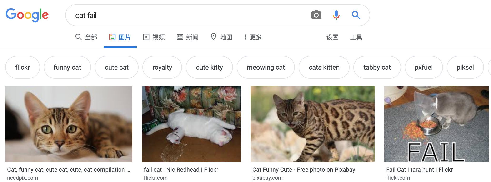
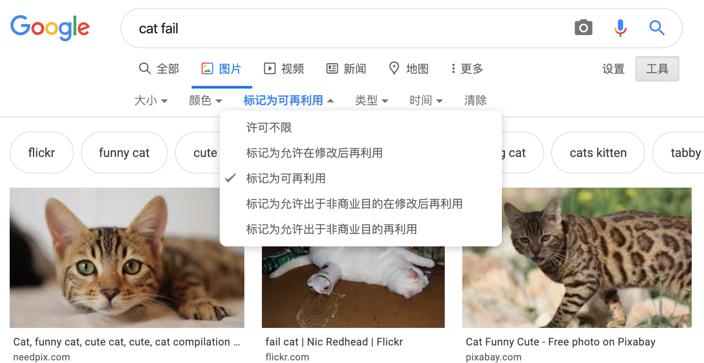
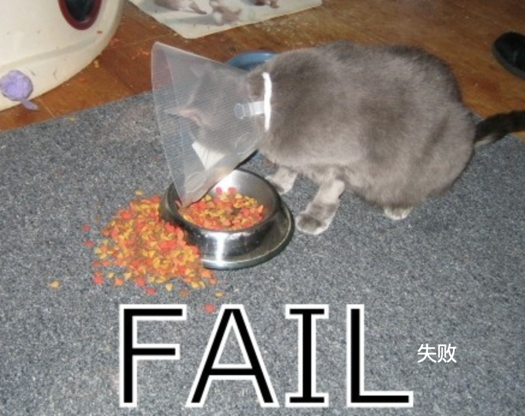

因为有版权法，您不能随心所欲的使用在网上搜索到的所有内容 在这里，您将学习如何在不违反版权法的情况下找到可用于数字创作的图像。

### 了解版权法

版权法旨在保护艺术，文学，音乐和戏剧作品的创作者，防止其作品被利用或滥用。 这意味着版权法适用于离线和在线的所有形式的材料，包括图像和艺术作品。

任何人未经所有者许可而使用受版权保护的作品都将构成侵犯版权的罪行。 即使对原作品进行了很多修改，有时也是如此。

互联网上的许多图像都受到版权保护。 图像中不一定非要存在版权符号©才能宣布版权存在。

如果您要使用需要许可的图像，那意味着您需要获得所有版权所有者的许可。 否则，您可以通过搜索可免费使用的遵循知识共享许可(Creative Commons)的图像。

### 知识共享许可

知识共享许可允许图像创建者选择他们想要以何种方式授权人们使用他们的作品进行创作。 使用知识共享许可，您可以放弃您的作品的全部权利，或仅其中的一部分。 知识共享网站上有 [在线表格](https://creativecommons.org/){:target="_blank"}，可帮助您准确确定要放弃的权利。

知识共享许可使人们更容易找到他们有权使用的图像。 在知识共享网站上，有一个 [搜索工具](https://creativecommons.org/){:target="_blank"}，您可以用它来查找具有知识共享许可的图像。 寻找遵循知识共享许可的图像的另一个好地方是 [Wikimedia Commons](https://commons.wikimedia.org/wiki/Main_Page){:target="_blank"}。

许多搜索引擎还提供了一种专门用于搜索遵循知识共享许可的图像的方法，因此人们可以避免违反版权法。

### 使用 Google 搜索图像

如果您正在使用 Google，请按照以下说明查找可以在数字制作中使用的图像：

+ 转到 Google 图片搜索并输入您想要搜索的内容。 在这里，我们搜索了 `cat fail`：

+ 点击 **工具**，然后点击 **使用权限** ，然后选择 **标记为可再利用** 。

+ 选择一个图片。

+ 反复检查它是否可自由使用。 您可以使用 [TinEye](https://www.tineye.com/){:target="_blank"} 或 [Image Raider](https://www.imageraider.com/){:target="_blank"} 之类的反向图片搜索工具(用图片搜图片或信息，译注)，以检查您是否有使用权限。 这里我从 Google 搜索中复制了图像链接，并将其粘贴到 TinEye 中，然后按 **Search**。 如您所见，该图像已在互联网上使用了很多次(781次!)，因此很可能是免费使用的。 如果对是否能使用有疑问，您应该给所有者写信，并请求授权。

### 线上安全

如果你 [偶然发现某个令你不舒服或不安的图像](https://www.thinkuknow.co.uk/11_13/Need-advice/Things-you-see-online/){:target="_blank"}，立即关闭浏览器并告诉家人。